## PetShopAdmin

Uma aplicação simulando um de um PetShop onde se realiza venda de produtos, filhotes e serviços.

## Componentes

### Laravel 5.6
-Site do Laravel : **[Laravel](https://laravel.com/)**

### AdminLTE
- GitHub : **[AdminLTE](https://github.com/jeroennoten/Laravel-AdminLTE)**

### Composer
- Site do Composer : **[composer](https://getcomposer.org/)**

### Bootstrap 3.3.7
- Site do Bootstrap : **[Bootstrap](https://getbootstrap.com/docs/3.3/getting-started/)**

### JQuery Mask
- GitHub : **[Mask](https://github.com/igorescobar/jQuery-Mask-Plugin)**

### API Correios
- GitHub : **[API](https://github.com/EscapeWork/Frete)**


## PetShop Admin

Este é um projeto simples que está longe de ser usado para produção, apenas algo para estudos. Mas caso você goste da base e queria modificar e melhorar para usar, sinta-se livre. Contribuia com o projeto com um fork e mande um pull request com suas melhorias.


### A Demo
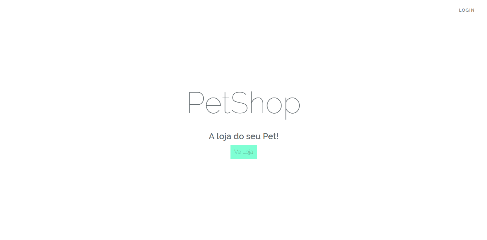

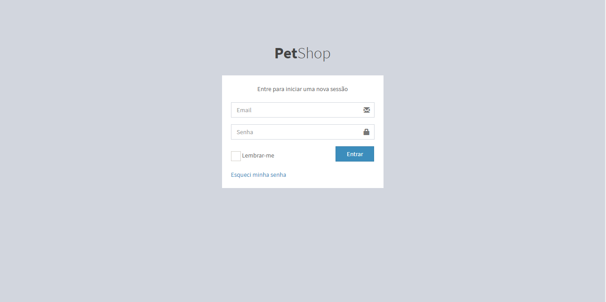

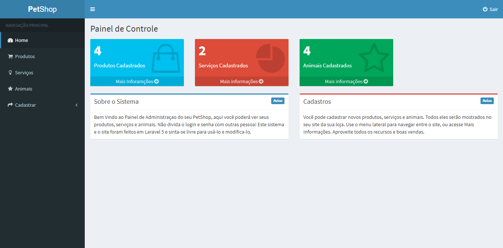

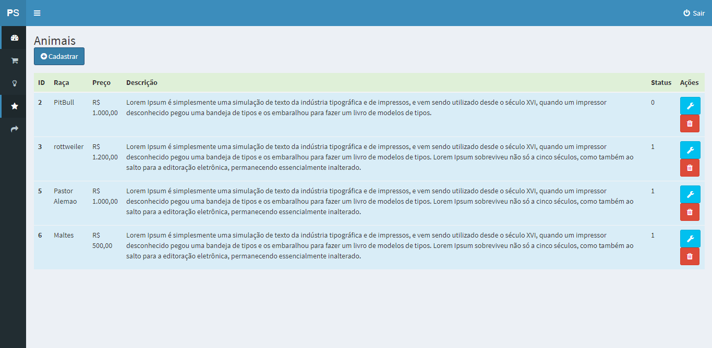

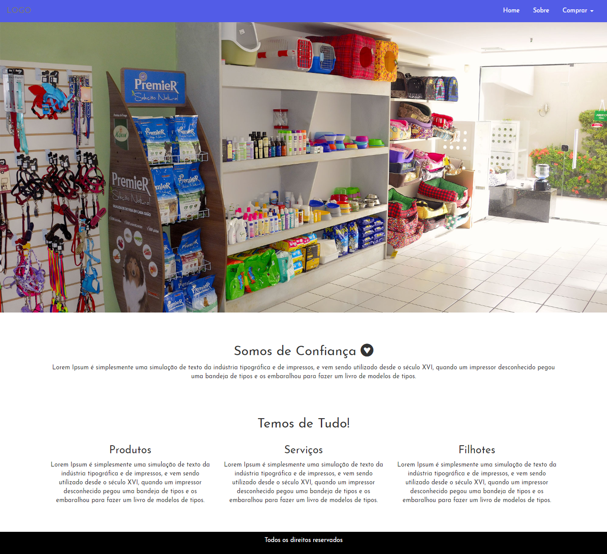

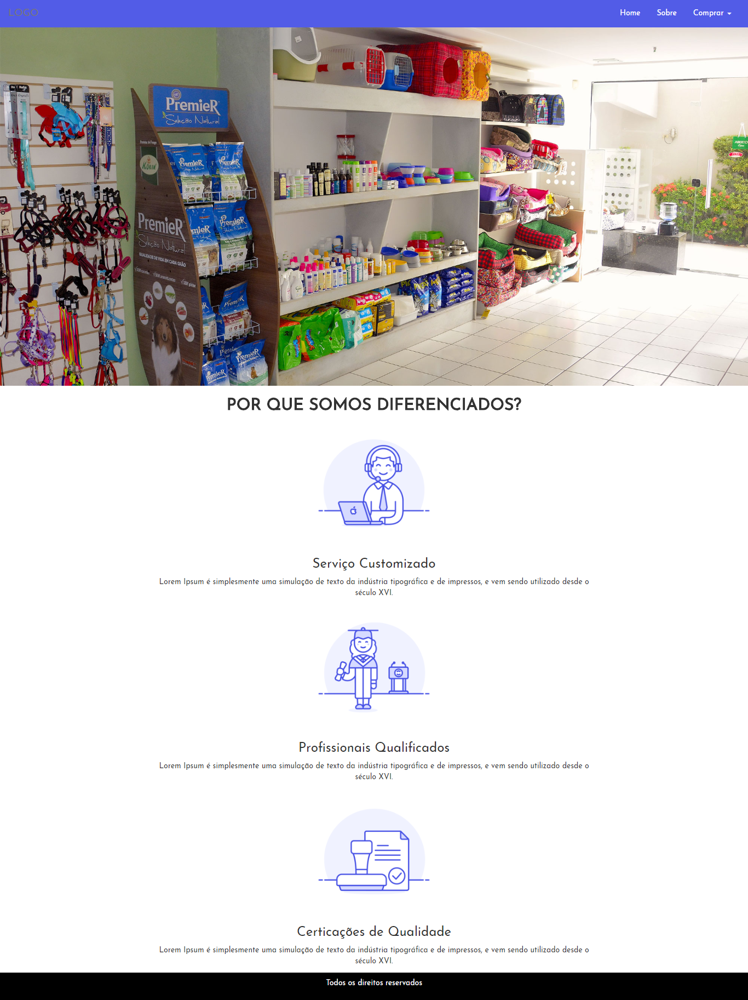

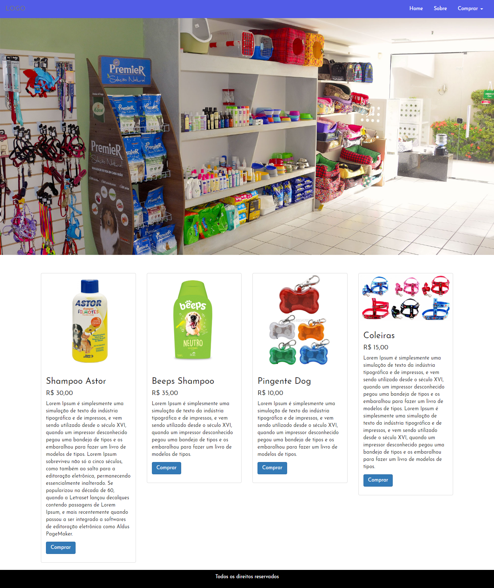

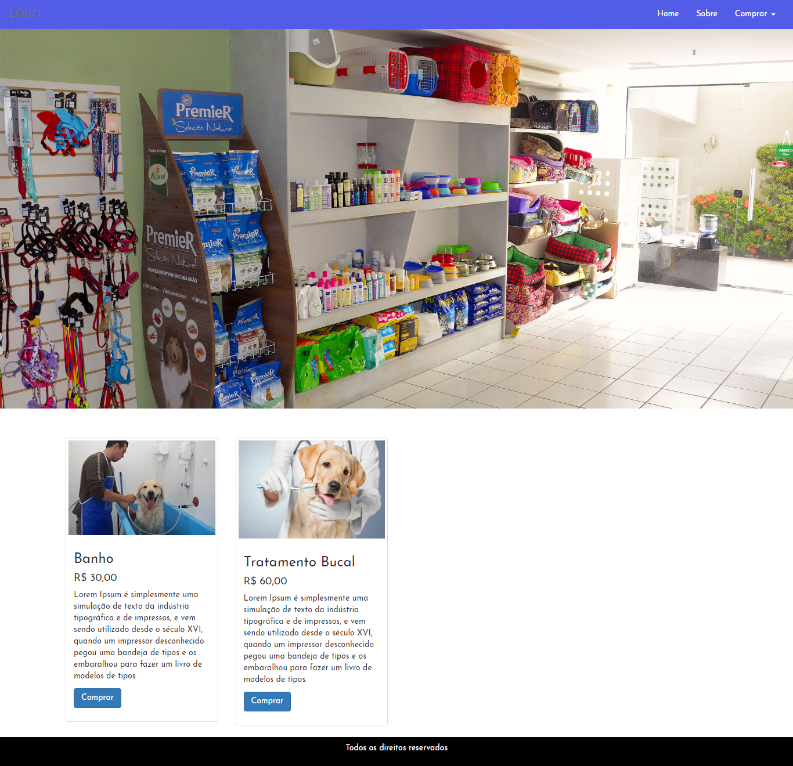

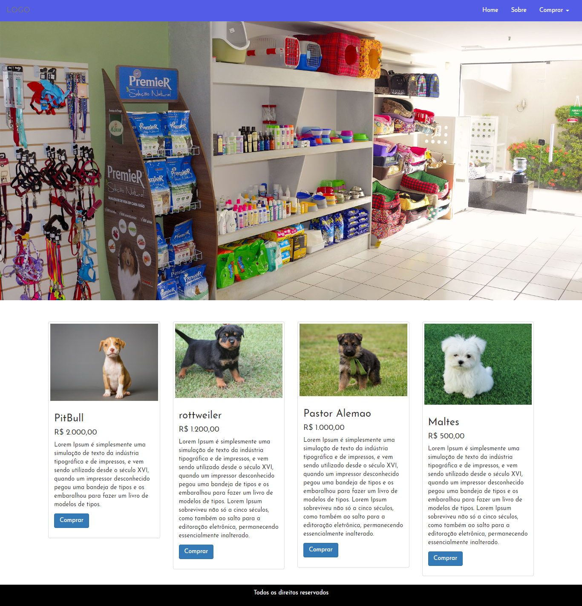

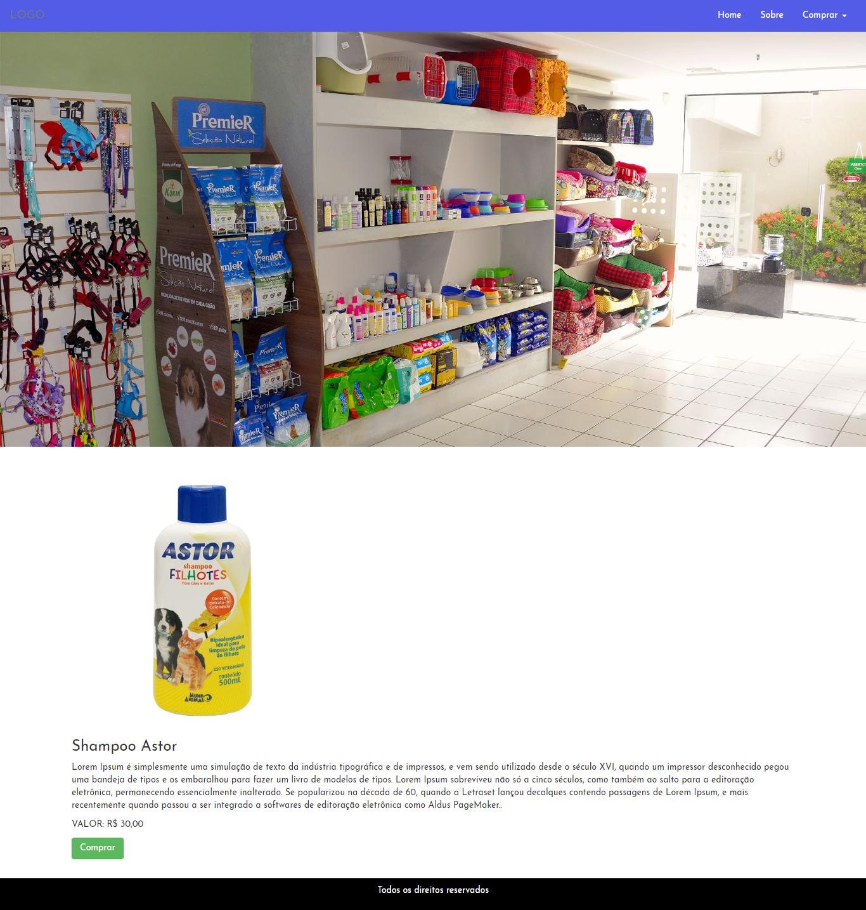

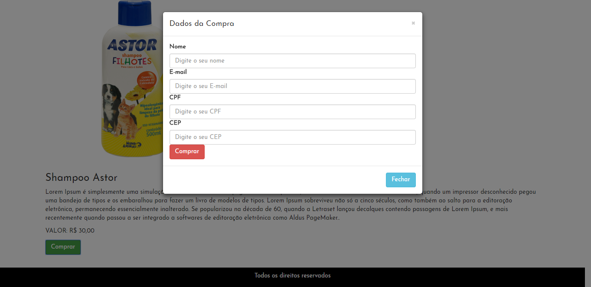

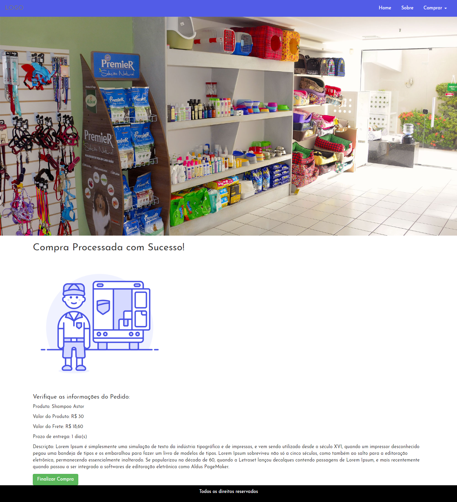


# Instalação

## Passo 1

### Com Git
Clone o repositório Git

Com Git SSH
```
git clone git@github.com:JohnatanT/PetShopAdmin.git
```

Ou com HTTPS
```
git clone https://github.com/JohnatanT/PetShopAdmin.git
```

Entre na pasta do Projeto
```
cd PetShopAdmin
```

Atualize as dependências do composer 
```
composer update
```

## Passo 2
Configure corretamente sua conexão no arquvivo ```.env```

Não esqueça de ter criado um Banco de Dados antes para subir as Migrations.
Além disso ter habilidatado a extensão do PDO em seu ```php.ini```

## Passo 3
Suba as ```migrations``` e as ```sedeers```

Migrations
```
php artisan migrate
```
Sedeers
```
php artisan db:seede
```

Agora, vamos iniciar a aplicação 

Use o próprio servidor PHP do Laravel:

```
php artisan serve
```

Agora você pode acessar pelo seu navegador:

```
17.0.0.1:8000
```

Por padrão as Sedder que você subiu vem apenas com o Login e Senha do Administrador !
Então você precisará cadastrar os produtos, serviços e filhotes no Painel de Administração para aparecerem na loja.

**Atenção** : Login  ```admin@gmail.com```, senha ```admin``` não compartilhe com ninguém !


Você está pronto para começar. Bons estudos e desenvolvimento !!

